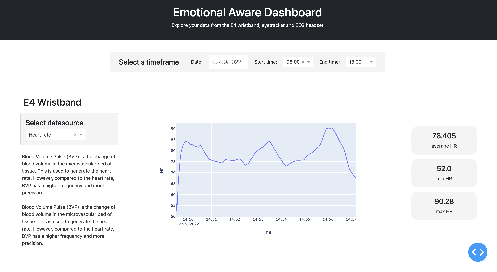

# Emotion Aware Dashboard
This is an application to visualize data from various sensors such as, Empatica E4 wristband, Emotive EEG headset and Eye-tracker. The dashboard provides you with interactive graphs that can be filtered by date and time. It also provide models to aggregate and clean the data.

### Installation
Clone the repository and and create a virtual environment if you prefer. To install the required libraries, run:
`pip3 install -r requirements.txt`

The following command will run the flask server. Paste the output url in the browser.
`python3 app.py`
